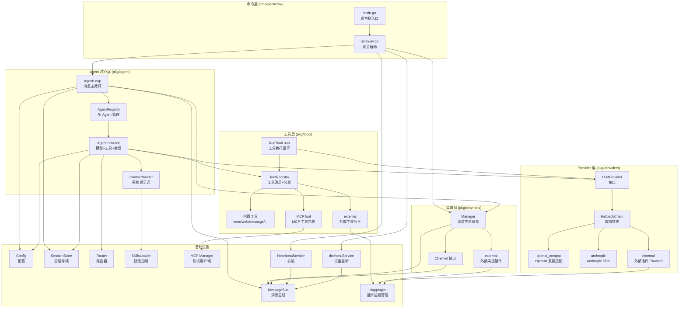
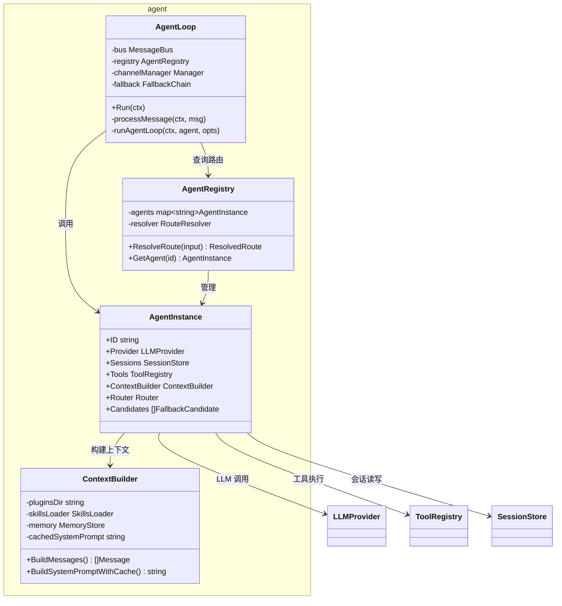
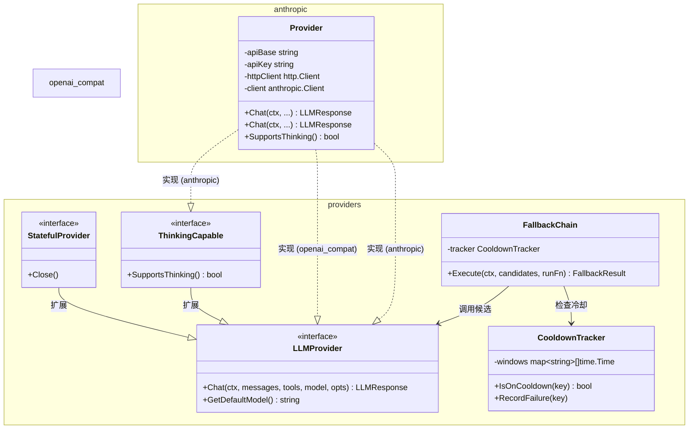
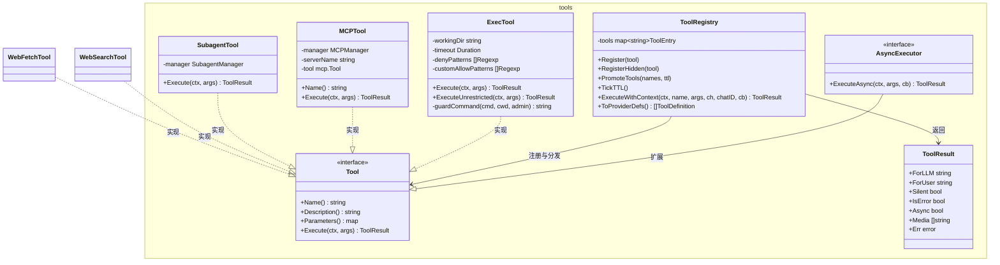
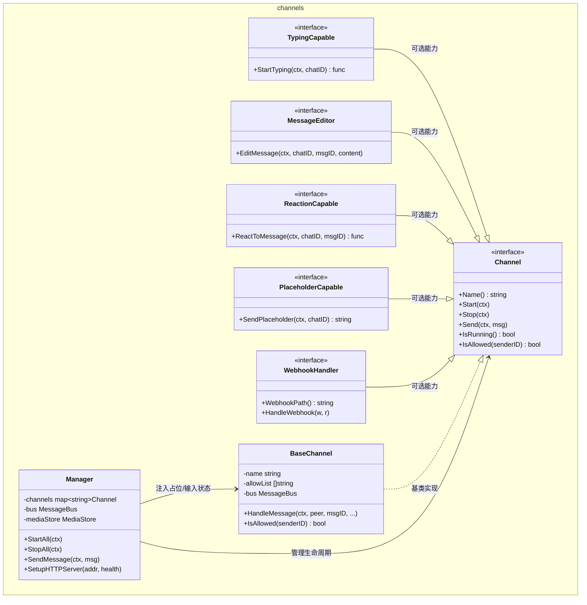

# 架构文档

## 模块划分

| 模块名 | 目录 | 职责 | 核心类型 |
|--------|------|------|----------|
| 消息总线 | `pkg/bus` | 进程内 pub/sub，解耦渠道与 Agent | `MessageBus`, `InboundMessage`, `OutboundMessage` |
| 配置管理 | `pkg/config` | YAML 配置加载、模型解析、环境变量集中管理 | `Config`, `ModelConfig`, `RoutingConfig` |
| Agent 核心 | `pkg/agent` | 消息处理主循环、上下文构建、会话管理 | `AgentLoop`, `AgentInstance`, `ContextBuilder` |
| Provider 层 | `pkg/providers` | LLM 调用抽象、多协议适配、故障转移 | `LLMProvider`, `FallbackChain`, openai_compat |
| 工具系统 | `pkg/tools` | 工具接口定义、注册表、内置工具实现 | `Tool`, `ToolRegistry`, `ToolResult` |
| 渠道系统 | `pkg/channels` | 渠道抽象、生命周期管理、HTTP Webhook 分发 | `Channel`, `BaseChannel`, `Manager` |
| 会话存储 | `pkg/session` | 对话历史持久化（JSONL）| `SessionStore`, `JSONLBackend` |
| 路由系统 | `pkg/routing` | 复杂度路由选模型、多 Agent 路由绑定 | `Router`, `RouteResolver` |
| 技能系统 | `pkg/skills` | Markdown 技能文件加载与注入 | `SkillsLoader` |
| MCP 客户端 | `pkg/mcp` | Model Context Protocol 协议客户端 | `Manager` |
| 插件管理 | `pkg/plugin` | 外部插件子进程生命周期（启动/通信/关闭）| `PluginProcess` |
| 心跳服务 | `pkg/heartbeat` | 定期读取 HEARTBEAT.md 触发 Agent | `HeartbeatService` |
| 设备监听 | `pkg/devices` | USB 等设备事件监听并推送消息 | `Service`, `EventSource` |
| 认证系统 | `pkg/auth` | OAuth Token 存储与刷新 | `TokenStore` |
| 基础设施 | `pkg/{bus,logger,fileutil,state,health}` | 日志、状态持久化、健康检查 | — |

---

## 模块级别依赖关系图

---

## 类级别依赖关系图

### Agent 核心

### Provider 层

### 工具系统

### 渠道系统

---

## 第三方依赖

| 库名 | 用途 |
|------|------|
| `github.com/anthropics/anthropic-sdk-go` | Anthropic API 官方 SDK |
| `github.com/openai/openai-go/v3` | OpenAI API 官方 SDK |
| `github.com/modelcontextprotocol/go-sdk` | MCP 协议客户端 |
| `github.com/spf13/cobra` | CLI 命令框架 |
| `github.com/gorilla/mux` | HTTP 路由 |
| `github.com/dromara/carbon/v2` | 时间处理 |
| `github.com/adhocore/gronx` | Cron 表达式解析 |
| `gopkg.in/yaml.v3` | YAML 配置解析 |
| `golang.org/x/net` | 网络工具（HTML 解析等）|
