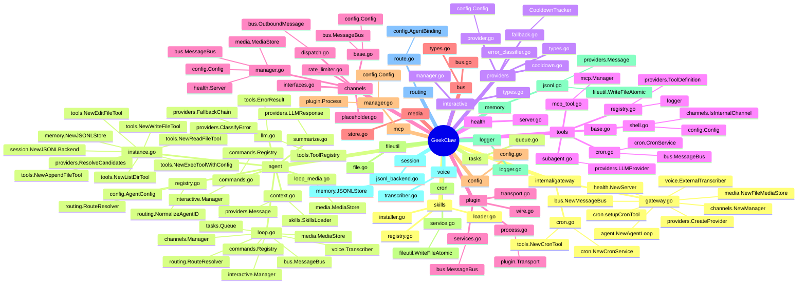

# 文件调用关系图

## 全局依赖总览



---

## 分层调用关系

```mermaid
flowchart TD
    subgraph ENTRY["入口层"]
        GW["internal/gateway/gateway.go"]
        GW_CRON["internal/gateway/cron.go"]
    end

    subgraph AGENT["Agent 核心层"]
        LOOP["agent/loop.go\n消息主循环·并发分发"]
        LLM["agent/llm.go\nLLM 调用·工具执行"]
        INST["agent/instance.go\n实例创建·工具注册"]
        REG["agent/registry.go\n多 Agent 路由"]
        CTX["agent/context.go\n系统提示词缓存"]
        SUM["agent/summarize.go\n历史摘要·Token 估算"]
        CMD["agent/commands.go\n斜杠命令"]
        MEDIA_R["agent/loop_media.go\n媒体解析"]
        SESS_A["agent/session.go\n会话模式"]
        MEM_A["agent/memory.go\n记忆文件"]
        SKILL_C["agent/skills_context.go\n技能注入"]
        SYNC["agent/syncmap.go\nTypedMap"]
        THINK["agent/thinking.go\nThinkingLevel"]
    end

    subgraph PROV["Provider 层"]
        PROV_F["providers/provider.go\n工厂"]
        FB["providers/fallback.go\n故障转移·缓存"]
        CD["providers/cooldown.go\n冷却追踪"]
        EC["providers/error_classifier.go\n错误分类"]
        PT["providers/types.go\n类型定义"]
    end

    subgraph TOOL["工具层"]
        T_REG["tools/registry.go\n注册表·排序缓存"]
        T_BASE["tools/base.go\n接口定义"]
        T_CRON["tools/cron.go\nCronTool"]
        T_SHELL["tools/shell.go\nExecTool"]
        T_WEB["tools/web.go\nWebSearchTool"]
        T_MCP["tools/mcp_tool.go\nMCPTool"]
        T_SUB["tools/subagent.go\nSpawnTool"]
    end

    subgraph CHAN["渠道层"]
        CH_MGR["channels/manager.go\n生命周期"]
        CH_BASE["channels/base.go\n基类"]
        CH_DISP["channels/dispatch.go\n分发·背压"]
        CH_IF["channels/interfaces.go\n能力接口"]
        CH_RATE["channels/rate_limiter.go\n速率限制"]
        CH_PH["channels/placeholder.go\n占位符"]
        CH_SPLIT["channels/split.go\n消息拆分"]
        CH_JAN["channels/janitor.go\nTTL 清理"]
    end

    subgraph INFRA["基础设施层"]
        BUS_GO["bus/bus.go\n消息总线"]
        BUS_T["bus/types.go\n消息类型"]
        CFG["config/config.go\n配置"]
        CRON_S["cron/service.go\n定时调度"]
        HEALTH["health/server.go\n健康检查"]
        INTER_M["interactive/manager.go\n确认管理"]
        INTER_T["interactive/types.go"]
        TASK_Q["tasks/queue.go\n任务队列"]
        MEM_J["memory/jsonl.go\nJSONL 存储"]
        SESS_J["session/jsonl_backend.go\n会话后端"]
        ROUTE["routing/route.go\n路由解析"]
        SKILL_L["skills/loader.go\n技能加载"]
        MCP_M["mcp/manager.go\nMCP 客户端"]
        MEDIA_S["media/store.go\n媒体存储"]
        PLG_P["plugin/process.go\n进程管理"]
        PLG_T["plugin/transport.go\nJSON-RPC"]
        PLG_S["plugin/services.go\n反向调用"]
        PLG_W["plugin/wire.go\n协议类型"]
        FUTIL["fileutil/file.go\n原子写入"]
        LOG["logger/logger.go\n日志"]
        VOICE["voice/transcriber.go\n语音"]
    end

    %% 入口层
    GW --> LOOP
    GW --> CH_MGR
    GW --> BUS_GO
    GW --> PROV_F
    GW --> HEALTH
    GW --> MEDIA_S
    GW --> VOICE
    GW_CRON --> CRON_S
    GW_CRON --> T_CRON

    %% Agent 核心层内部
    LOOP --> LLM
    LOOP --> REG
    LOOP --> CMD
    LOOP --> SESS_A
    LOOP --> MEDIA_R
    LOOP --> SUM
    LLM --> T_REG
    INST --> T_REG
    INST --> SESS_J
    CTX --> SKILL_C
    CTX --> MEM_A

    %% Agent → 外部依赖
    LOOP --> BUS_GO
    LOOP --> CH_MGR
    LOOP --> INTER_M
    LOOP --> TASK_Q
    LOOP --> ROUTE
    LLM --> FB
    LLM --> EC
    INST --> MEM_J
    REG --> ROUTE
    REG --> CFG
    CTX --> SKILL_L
    CMD --> INTER_M
    MEDIA_R --> MEDIA_S
    LOOP --> VOICE

    %% Provider 层内部
    PROV_F --> CFG
    FB --> CD

    %% 工具层
    T_REG --> T_BASE
    T_CRON --> CRON_S
    T_CRON --> BUS_GO
    T_SHELL --> CFG
    T_MCP --> MCP_M
    T_SUB --> PT

    %% 渠道层
    CH_MGR --> CH_BASE
    CH_MGR --> CH_DISP
    CH_MGR --> HEALTH
    CH_MGR --> MEDIA_S
    CH_BASE --> BUS_GO
    CH_DISP --> BUS_T
    CH_DISP --> CH_SPLIT
    CH_MGR --> CH_RATE
    CH_MGR --> CH_PH
    CH_MGR --> CH_JAN

    %% 基础设施互相依赖
    SESS_J --> MEM_J
    MEM_J --> FUTIL
    CRON_S --> FUTIL
    MEM_A --> FUTIL
    MCP_M --> PLG_P
    PLG_P --> PLG_T
    PLG_S --> BUS_GO

    %% 样式
    style ENTRY fill:#e1f5fe
    style AGENT fill:#fff3e0
    style PROV fill:#f3e5f5
    style TOOL fill:#e8f5e9
    style CHAN fill:#fce4ec
    style INFRA fill:#f5f5f5
```



---

## 包级别依赖矩阵

> ✓ = 直接依赖，○ = 间接依赖

| 调用方 ↓ / 被调用方 → | bus | config | providers | tools | channels | routing | session | memory | cron | tasks | interactive | media | health | plugin | mcp | skills | fileutil | logger |
|---|---|---|---|---|---|---|---|---|---|---|---|---|---|---|---|---|---|---|
| **gateway** | ✓ | ○ | ✓ | ○ | ✓ | | | | ○ | | | ✓ | ✓ | | | | | ✓ |
| **agent/loop** | ✓ | ✓ | ✓ | ✓ | ✓ | ✓ | | | | ✓ | ✓ | ✓ | | | | | ✓ | ✓ |
| **agent/llm** | ✓ | | ✓ | ✓ | ✓ | | | | | | | | | | | | | ✓ |
| **agent/instance** | | ✓ | ✓ | ✓ | | ✓ | ✓ | ✓ | | | | | | | | | | |
| **agent/context** | | | ✓ | | | | | | | | | | | | | ✓ | | ✓ |
| **agent/commands** | ✓ | | | ✓ | ✓ | | | | | | ✓ | | | | | | | |
| **tools/cron** | ✓ | ✓ | | | ✓ | | | | ✓ | | | | | | | | | |
| **tools/shell** | | ✓ | | | ✓ | | | | | | | | | | | | | |
| **tools/mcp** | | | | | | | | | | | | | | | ✓ | | | |
| **tools/subagent** | | | ✓ | | | | | | | | | | | | | | | |
| **channels/mgr** | ✓ | ✓ | | | | | | | | | | ✓ | ✓ | | | | | ✓ |
| **channels/base** | ✓ | ✓ | | | | | | | | | | ✓ | | | | | | ✓ |
| **cron** | | | | | | | | | | | | | | | | | ✓ | |
| **memory** | | | ✓ | | | | | | | | | | | | | | ✓ | |
| **session** | | | ✓ | | | | | ✓ | | | | | | | | | | |
| **mcp** | | ✓ | | | | | | | | | | | | ✓ | | | | ✓ |
| **plugin** | | | | | | | | | | | | | | | | | | ✓ |
| **plugin/svc** | ✓ | | | | | | | | | | | | | | | | | |

---

## 关键调用链

### 消息处理链
```
gateway.go → agent/loop.go → agent/llm.go → tools/registry.go → tools/*.go
                  ↓                                    ↓
            bus/bus.go                          providers/fallback.go
                  ↓                                    ↓
         channels/dispatch.go              providers/cooldown.go
                  ↓
         channels/base.go
```

### 会话持久化链
```
agent/instance.go → session/jsonl_backend.go → memory/jsonl.go → fileutil/file.go
```

### 定时任务链
```
gateway/cron.go → cron/service.go → tools/cron.go → agent/loop.go (ProcessDirect)
                                                          ↓
                                                    bus/bus.go (PublishInbound)
```

### 插件生命周期链
```
agent/loop.go → tools/external/*.go → plugin/process.go → plugin/transport.go
channels/manager.go → channels/external/*.go → plugin/process.go
```
