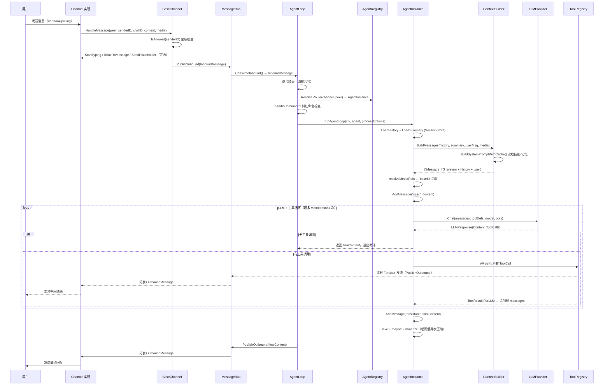
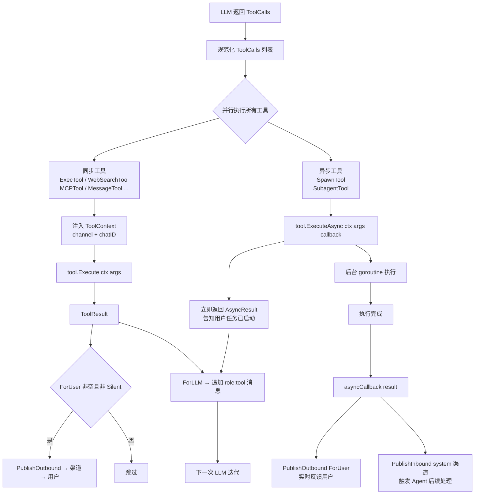
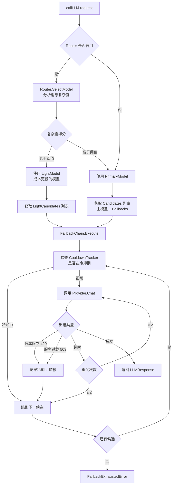
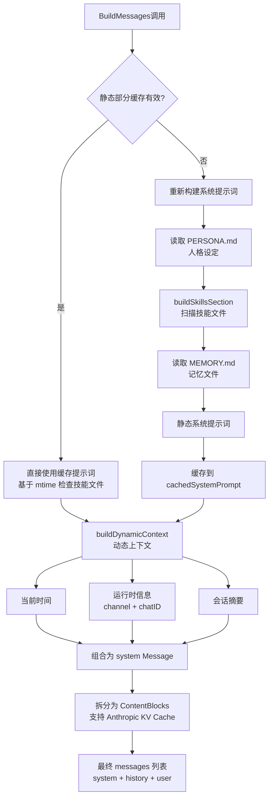
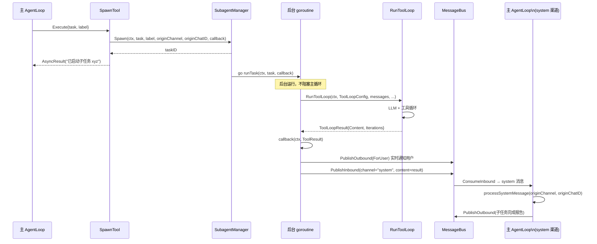
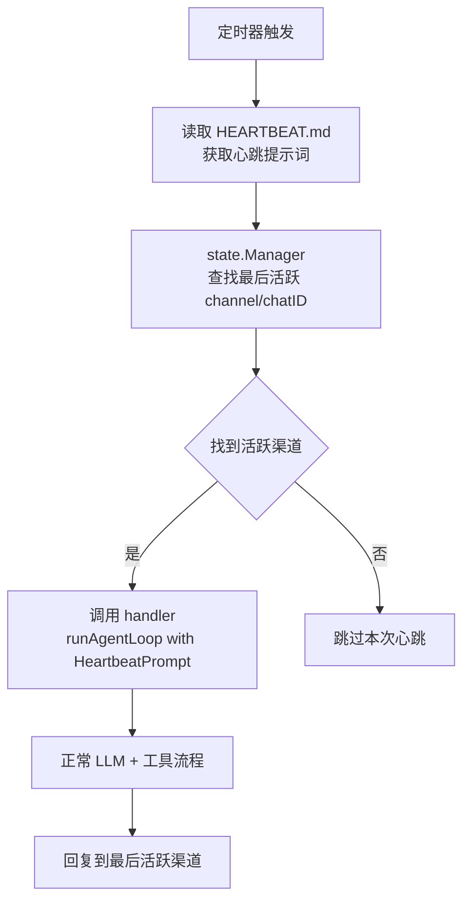
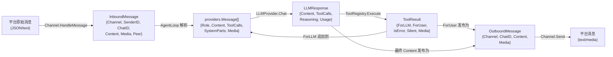

# 业务逻辑与数据流

## 主程序启动流程

```mermaid
flowchart TD
    Start([geekclaw gateway]) --> LoadCfg[加载配置文件\nconfig.LoadConfig]
    LoadCfg --> CreateProvider[创建 LLM Provider\nproviders.CreateProvider]
    CreateProvider --> NewBus[创建消息总线\nbus.NewMessageBus]
    NewBus --> NewAgent[创建 AgentLoop\nagent.NewAgentLoop]

    NewAgent --> RegAgents[注册所有 AgentInstance\nAgentRegistry]
    RegAgents --> RegTools[为每个 Agent 注册工具\nToolRegistry]
    RegTools --> LoadPlugins[加载外部插件\n搜索/工具/命令插件]

    LoadPlugins --> SetupCron[初始化 CronService]
    SetupCron --> SetupHB[初始化 HeartbeatService]
    SetupHB --> SetupMedia[初始化 MediaStore\n含 TTL 清理协程]
    SetupMedia --> InitChannels[初始化渠道 Manager\n启动外部渠道子进程]
    InitChannels --> SetupHTTP[注册 HTTP Webhook + 健康检查端点]
    SetupHTTP --> StartAll[channelManager.StartAll\n启动所有渠道 goroutine]
    StartAll --> StartLoop[go agentLoop.Run\n启动 Agent 消息循环]
    StartLoop --> WaitSig{等待 SIGINT}
    WaitSig -->|收到信号| Shutdown[优雅关闭]
    Shutdown --> StopCh[1. cancel context]
    StopCh --> StopChannels[2. channelManager.StopAll\n停止消息源]
    StopChannels --> StopAgent[3. agentLoop.Stop\n停止消费者]
    StopAgent --> StopCron[4. cronService.Stop\n停止定时任务]
    StopCron --> CloseBus[5. msgBus.Close\n最后关闭总线]
    CloseBus --> Cleanup[6. 清理 Provider/Voice/Media]
    Cleanup --> End([退出])
```

---

## 核心业务流程

### 流程1：入站消息处理（渠道 → LLM → 回复）

**触发条件**: 用户通过 Telegram/Discord/CLI 等渠道发送消息
**涉及模块**: Channel → Bus → AgentLoop → Agent → LLM → Channel

---

### 流程2：工具执行（同步 vs 异步）

**触发条件**: LLM 返回包含 `ToolCalls` 的响应
**涉及模块**: AgentInstance → ToolRegistry → Tool → Bus

---

### 流程3：故障转移与模型路由

**触发条件**: LLM 调用失败或启用复杂度路由
**涉及模块**: AgentInstance → Router → FallbackChain → Provider

---

### 流程4：系统提示词构建（带 KV Cache 优化）

**触发条件**: 每次 LLM 调用前
**涉及模块**: ContextBuilder → SkillsLoader → SessionStore

---

### 流程5：异步子 Agent（Spawn Tool）

**触发条件**: 主 Agent 调用 `spawn` 工具
**涉及模块**: SpawnTool → SubagentManager → RunToolLoop → system 渠道 → AgentLoop

---

### 流程6：心跳检查

**触发条件**: 定时器触发（最小间隔 5 分钟）
**涉及模块**: HeartbeatService → AgentLoop → LLM

---

## 关键数据结构流转

