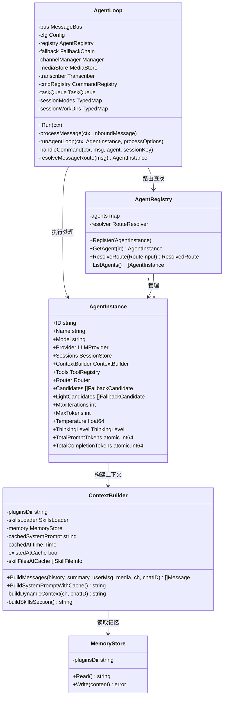
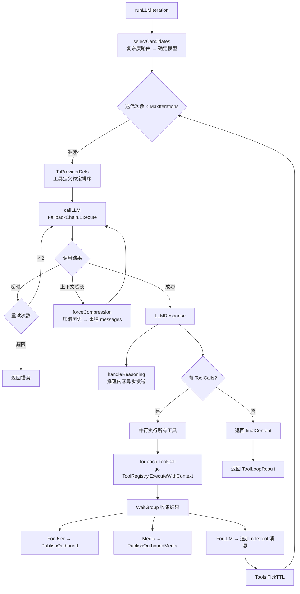

# 模块：Agent 核心层

## 模块概述

| 项目 | 内容 |
|------|------|
| 目录 | `pkg/agent/` |
| 职责 | 接收入站消息、管理多 Agent 实例、执行 LLM + 工具循环、构建系统上下文 |
| 核心类型 | `AgentLoop`, `AgentInstance`, `AgentRegistry`, `ContextBuilder` |
| 依赖模块 | bus, channels, providers, tools, session, routing, skills, config, mcp, media, memory |

---

## 文件清单

| 文件 | 职责 |
|------|------|
| `loop.go` | `AgentLoop` — 主消息循环、消息路由、命令处理 |
| `llm.go` | `runLLMIteration()` — LLM 调用 + 工具执行核心循环 |
| `instance.go` | `AgentInstance` — 单个 Agent 的模型/工具/会话配置 |
| `registry.go` | `AgentRegistry` — 多 Agent 注册与路由解析 |
| `context.go` | `ContextBuilder` — 系统提示词构建（含 mtime 缓存）|
| `skills_context.go` | `buildSkillsSection()` — 技能文件扫描与注入 |
| `summarize.go` | `maybeSummarize()` — 异步会话摘要与历史压缩 |
| `commands.go` | 斜杠命令处理逻辑 |
| `memory.go` | `MemoryStore` — Agent 记忆文件读写 |

---

## 类关系图

---

## 内部业务流程

### LLM + 工具循环 (`llm.go`)

---

## 对外接口

| 方法 | 参数 | 返回值 | 说明 |
|------|------|--------|------|
| `AgentLoop.Run(ctx)` | `context.Context` | — | 启动主消息循环（阻塞）|
| `AgentLoop.SetChannelManager(m)` | `*channels.Manager` | — | 注入渠道管理器 |
| `AgentLoop.SetMediaStore(s)` | `media.MediaStore` | — | 注入媒体存储 |
| `AgentRegistry.ResolveRoute(input)` | `RouteInput` | `ResolvedRoute` | 根据渠道/对端路由到 Agent |
| `AgentInstance.NewContextBuilder(...)` | 多参数 | `*ContextBuilder` | 构建上下文器 |
| `ContextBuilder.BuildMessages(...)` | 历史/摘要/用户消息等 | `[]Message` | 构建完整消息列表 |

---

## 关键实现说明

### 系统提示词缓存

`ContextBuilder` 通过 mtime 检查技能文件（`skillFilesChangedSince`）来决定是否重建静态系统提示词。动态上下文（当前时间、channel、chatID、会话摘要）每次都重新构建，不走缓存。这样做既保证了 Anthropic KV Cache 的命中率（静态前缀稳定），又保证了动态信息的实时性。

### 并行工具执行

所有 ToolCall 通过 `sync.WaitGroup` 并发执行，结果按原始顺序收集，确保 `role:tool` 消息与 `ToolCallID` 正确对应。每次工具迭代后调用 `Tools.TickTTL()`，使 MCP 发现工具在限定轮数后自动隐藏。

### 会话摘要压缩

当消息数超过 `SummarizeMessageThreshold` 时，异步启动摘要流程：用 LLM 将历史压缩为摘要，然后调用 `TruncateHistory(4)` 只保留最近 4 条消息，摘要注入系统提示词的动态上下文部分。

### processOptions 中的 WorkingDir

每个会话维护独立的工作目录（存储在 `sessionWorkDirs` TypedMap 中），`ExecTool` 使用此目录作为命令执行的沙箱根目录。
