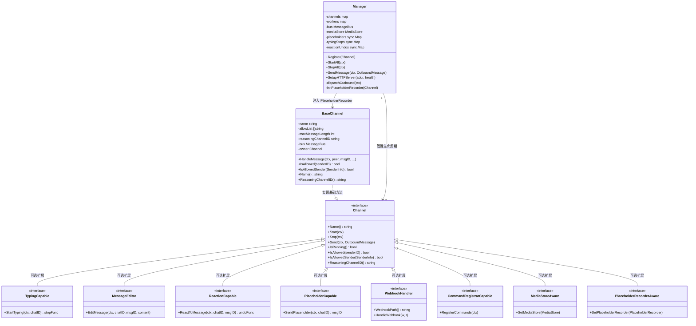
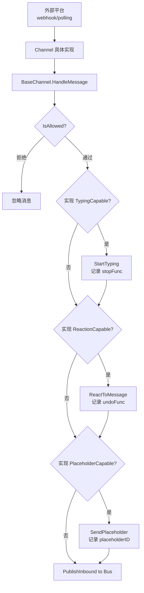

# 模块：渠道系统

## 模块概述

| 项目 | 内容 |
|------|------|
| 目录 | `pkg/channels/` |
| 职责 | 定义渠道抽象接口、管理渠道生命周期、分发入站/出站消息、托管 HTTP Webhook 服务器 |
| 核心类型 | `Channel`（接口）、`BaseChannel`（嵌入基类）、`Manager` |
| 依赖模块 | bus, config, media, health, commands |

---

## 文件清单

| 文件 | 职责 |
|------|------|
| `base.go` | `Channel` 接口定义、`BaseChannel` 嵌入基类 |
| `interfaces.go` | 可选能力接口（Typing/Edit/Reaction/Placeholder/Webhook 等）|
| `manager.go` | `Manager` — 渠道注册、消息分发、HTTP 服务器 |
| `init.go` | `initChannels()` — 从配置创建外部渠道实例 |
| `dispatch.go` | 出站消息分发循环（`dispatchOutbound`）|
| `rate_limiter.go` | 出站消息速率限制器 |
| `placeholder.go` | 占位消息状态管理（发送中→实际消息替换）|
| `janitor.go` | 空闲渠道清理协程 |
| `constants.go` | `IsInternalChannel()` — 判断是否为内部渠道（cli/system）|
| `identity.go` | `BuildCanonicalID`, `ParseCanonicalID`, `MatchAllowed` |

---

## 类关系图



---

## 内部业务流程

### 出站消息分发

```mermaid
flowchart TD
    BUS[MessageBus.outbound] --> DISP[dispatchOutbound 循环]
    DISP --> MSG[OutboundMessage{Channel, ChatID, Content}]
    MSG --> FIND[查找 channels[channelName]]
    FIND --> RUNNING{渠道在运行?}
    RUNNING -->|否| SKIP[丢弃消息]
    RUNNING -->|是| RATE[速率限制检查]
    RATE --> PLACEHOLDER{有占位消息?}
    PLACEHOLDER -->|是| EDIT[MessageEditor.EditMessage\n替换占位内容]
    PLACEHOLDER -->|否| SEND[Channel.Send]
    EDIT --> CLEANUP[清除占位记录]
    SEND --> DONE[完成]
```

### 入站消息触发流程



---

## 对外接口

| 方法 | 说明 |
|------|------|
| `Manager.Register(ch)` | 注册渠道实例 |
| `Manager.StartAll(ctx)` | 启动所有渠道（含分发循环）|
| `Manager.StopAll(ctx)` | 优雅停止所有渠道 |
| `Manager.SendMessage(ctx, msg)` | 向指定渠道发送消息（调用 `PublishOutbound`）|
| `Manager.SetupHTTPServer(addr, health)` | 注册 Webhook 路径 + 健康端点 |
| `BaseChannel.HandleMessage(...)` | 渠道具体实现调用此方法注入入站消息 |
| `IsInternalChannel(name)` | 返回 `true` 表示是 `cli`/`system` 等内部渠道 |

---

## 关键实现说明

### 能力接口的设计模式

`Manager` 通过 Go 的 type assertion 检测渠道是否实现了可选接口：
```go
if typing, ok := ch.(TypingCapable); ok {
    // 使用 typing.StartTyping(...)
}
```
这样新渠道只需实现基础 `Channel` 接口即可工作，高级能力（占位、编辑、反应）可按需实现。

### 占位消息机制

发送响应时，支持"占位"流程：
1. 渠道发送一条空的占位消息，获取平台的 `messageID`
2. 记录到 `placeholders` sync.Map
3. 当真正的响应到达时，通过 `MessageEditor.EditMessage` 替换占位内容
4. 用户侧体验为"消息更新"而非"新消息出现"

### 规范化 ID

`identity.go` 中的 `BuildCanonicalID(channel, accountID)` 生成统一格式的 ID 用于 allow-list 匹配，`MatchAllowed(id, patterns)` 支持通配符匹配。

### 外部渠道

所有实际的平台渠道（Telegram、Discord 等）均通过 `pkg/plugin` 机制以 Python 子进程运行，Go 侧通过 JSON-RPC 与之通信。`init.go` 中的 `initChannels()` 负责根据配置启动这些子进程并创建对应的 `ExternalChannel` 包装器。
