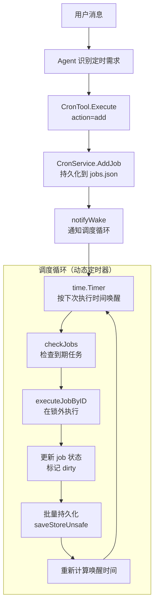

# 模块：定时任务（Cron）

## 模块概述

| 项目 | 内容 |
|------|------|
| 目录 | `pkg/cron/` |
| 职责 | 定时/周期/一次性任务的调度、持久化和执行 |
| 核心类型 | `CronService`, `CronJob`, `CronSchedule`, `CronPayload` |
| 依赖模块 | bus, tools（CronTool）, fileutil |

---

## 文件清单

| 文件 | 职责 |
|------|------|
| `service.go` | `CronService` — 任务调度引擎、持久化、执行回调 |
| `service_test.go` | 单元测试 |

---

## 核心概念

### 调度类型

| 类型 | 字段 | 示例 |
|------|------|------|
| `at` | `atMs` — 绝对时间戳 | 10 分钟后提醒 |
| `every` | `everyMs` — 循环间隔 | 每 2 小时执行 |
| `cron` | `expr` — Cron 表达式 | `0 9 * * *`（每天 9 点）|

### 执行模式

| `deliver` | 行为 |
|-----------|------|
| `true` | 直接将消息发送到频道（简单提醒）|
| `false` | 将消息作为 InboundMessage 发布到总线，由 Agent 处理（复杂任务）|
| `command` | 执行 shell 命令并将输出发送到频道 |

---

## 架构流程

---

## 关键实现说明

### 动态定时器

使用 `time.Timer` 代替固定 1 秒轮询。根据所有任务中最早的 `nextRunAtMS` 精确设置唤醒时间，最长睡眠 60 秒保底。新增/启用任务时通过 `wakeChan` 非阻塞通知调度循环重新计算。

### 批量持久化

多个到期任务在同一个 `checkJobs` 周期内执行后，统一调用一次 `saveStoreUnsafe()`，而非每个任务单独写盘。通过 `dirty` 标志跟踪是否有未持久化的状态变更。

### 安全约束

- `command` 调度仅限内部频道（CLI），需要显式 `command_confirm=true`
- 非命令提醒对所有频道开放
- 一次性任务（`at` 类型）执行后自动删除
