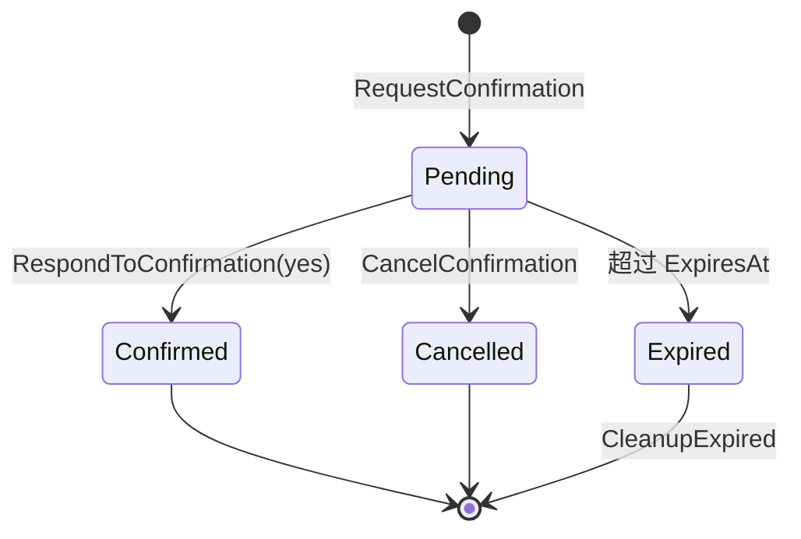

# 模块：交互管理（Interactive）

## 模块概述

| 项目 | 内容 |
|------|------|
| 目录 | `pkg/interactive/` |
| 职责 | 管理交互式确认请求和执行计划的会话状态 |
| 核心类型 | `Manager`, `ConfirmationRequest`, `ExecutionPlan`, `Session` |
| 依赖模块 | 无外部依赖（纯内存状态管理）|

---

## 文件清单

| 文件 | 职责 |
|------|------|
| `manager.go` | `Manager` — 会话管理、确认/计划的创建与响应 |
| `types.go` | 数据类型定义（`ConfirmationRequest`, `ExecutionPlan`, `Session` 等）|

---

## 核心概念

### 确认请求（ConfirmationRequest）

Agent 在执行危险操作前向用户发起确认。用户通过消息回复确认或取消。

```
Agent: "即将删除 50 个文件，确认执行？[yes/no]"
User: "yes"
Agent: → 执行删除
```

### 执行计划（ExecutionPlan）

Agent 提出多步执行计划，等待用户批准后逐步执行。

---

## 状态流转



---

## 关键实现说明

### 线程安全

所有会话/确认/计划操作都在 `sync.RWMutex` 保护下执行。`AddInteraction` 在锁内调用，避免并发写入竞态。

### 后台清理

`StartCleanup(interval)` 启动后台 goroutine，定期调用 `CleanupExpired()` 清理过期的确认请求和执行计划。`StopCleanup()` 在关闭时停止清理。

### 响应通道

确认请求通过 `ResponseCh chan string` 实现阻塞等待。如果接收方不在就绪状态，`select { default }` 会丢弃响应，防止 goroutine 泄漏。通道在使用后通过 `CloseResponseCh()` 安全关闭（幂等操作）。
