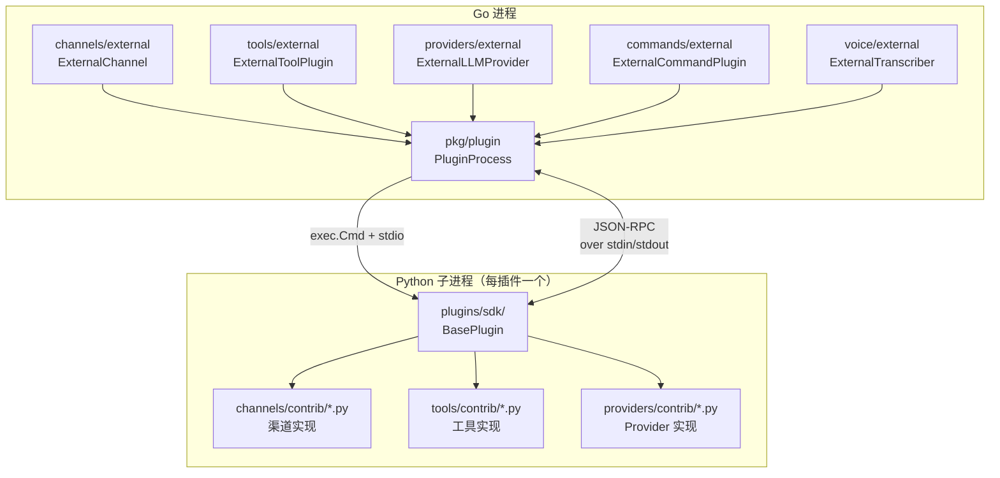
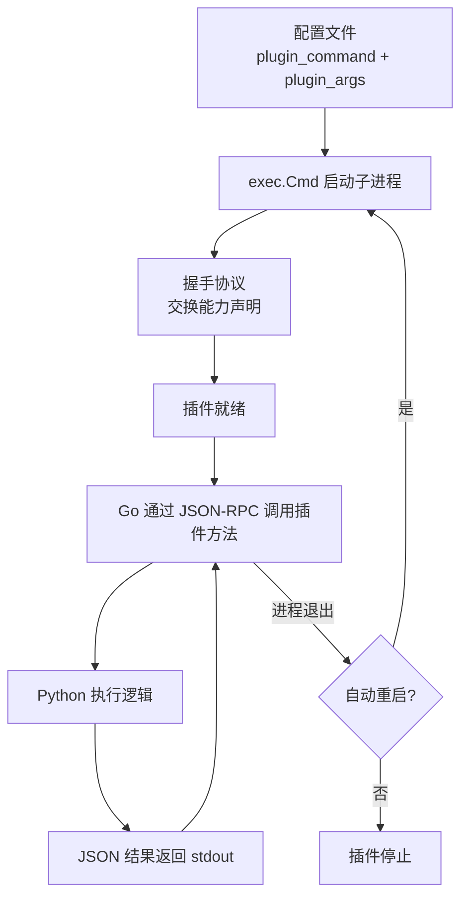

# 模块：插件系统

## 模块概述

| 项目 | 内容 |
|------|------|
| 目录 | `pkg/plugin/`、`plugins/`（Python 插件 SDK 与实现）|
| 职责 | 管理外部插件子进程生命周期，通过 JSON-RPC over stdio 与 Python 插件通信 |
| 核心类型 | `plugin.PluginProcess`（Go 侧）、`BasePlugin`（Python SDK）|
| 依赖模块 | channels/external, tools/external, providers/external, commands/external, voice/external, auth/external |

---

## 插件类型总览

| 插件类型 | Go 包 | 配置键 | Python 实现目录 | 用途 |
|----------|-------|--------|----------------|------|
| 渠道插件 | `channels/external` | `channels.external[]` | `plugins/channels/contrib/` | Telegram、Discord 等平台渠道 |
| 工具插件 | `tools/external` | `tools.plugins[]` | `plugins/tools/contrib/` | 自定义工具（文件管理、浏览器等）|
| 搜索插件 | `tools/external` | `tools.web.plugins[]` | `plugins/search/contrib/` | DuckDuckGo、Bing 等搜索引擎 |
| 命令插件 | `commands/external` | `commands.plugins[]` | `plugins/commands/contrib/` | 自定义斜杠命令 |
| Provider 插件 | `providers/external` | `model_list[protocol=external]` | `plugins/providers/contrib/` | 自定义 LLM Provider |
| 语音插件 | `voice/external` | `voice.plugins[]` | `plugins/voice/contrib/` | 语音转文字（Whisper 等）|
| 认证插件 | `auth/external` | `auth.plugins[]` | `plugins/auth/contrib/` | 自定义 OAuth 认证流程 |

---

## 已内置渠道插件

| 插件名 | 平台 | 文件 |
|--------|------|------|
| telegram | Telegram | `channels/contrib/telegram.py` |
| discord | Discord | `channels/contrib/discord_channel.py` |
| slack | Slack | `channels/contrib/slack_channel.py` |
| whatsapp | WhatsApp | `channels/contrib/whatsapp.py` |
| line | LINE | `channels/contrib/line.py` |
| dingtalk | 钉钉 | `channels/contrib/dingtalk.py` |
| feishu | 飞书 | `channels/contrib/feishu.py` |
| wecom | 企业微信 | `channels/contrib/wecom.py` |
| matrix | Matrix | `channels/contrib/matrix_channel.py` |
| qq | QQ | `channels/contrib/qq.py` |
| onebot | OneBot v11 | `channels/contrib/onebot.py` |
| irc | IRC | `channels/contrib/irc.py` |
| pico | Pico | `channels/contrib/pico.py` |
| maixcam | MaixCam 设备 | `channels/contrib/maixcam.py` |

---

## 插件系统架构图



---

## 插件生命周期



---

## Python 插件 SDK 结构

```
plugins/
├── __init__.py                  # 顶层包
├── sdk/
│   ├── __init__.py
│   ├── base.py                  # BasePlugin — 所有插件基类
│   ├── channel.py               # ChannelPlugin — 渠道插件基类
│   ├── tool.py                  # ToolPlugin — 工具插件基类
│   ├── provider.py              # ProviderPlugin — Provider 插件基类
│   ├── command.py               # CommandPlugin — 命令插件基类
│   ├── search.py                # SearchPlugin — 搜索插件基类
│   ├── voice.py                 # VoicePlugin — 语音插件基类
│   └── auth.py                  # AuthPlugin — 认证插件基类
```

---

## 渠道插件接口约定

Python 渠道插件通过 JSON-RPC 暴露以下方法（由 Go 侧 `ExternalChannel` 调用）：

| 方法 | 参数 | 返回值 | 说明 |
|------|------|--------|------|
| `start` | ctx | — | 启动渠道（polling/webhook 注册）|
| `stop` | — | — | 停止渠道 |
| `send` | `OutboundMessage` | — | 发送消息 |
| `is_running` | — | bool | 运行状态 |
| `is_allowed` | `senderID` | bool | 鉴权 |

渠道插件主动推送入站消息的方式：通过 stdout 发送 JSON-RPC notification，Go 侧 `ExternalChannel` 监听并调用 `BaseChannel.HandleMessage`。

---

## 技能系统（Skills）

技能不是插件，而是 **Markdown 文件**，注入系统提示词，引导 Agent 行为。

```
plugins/skills/
├── github/                  # GitHub 操作技能包
├── tmux/                    # tmux 终端管理技能
├── weather/                 # 天气查询技能
├── mcp/                     # MCP 服务器管理技能
└── ...
```

每个技能目录包含 `*.md` 文件，由 `SkillsLoader` 扫描并通过 `ContextBuilder.buildSkillsSection()` 注入系统提示词的静态部分。

---

## 关键实现说明

### 插件进程隔离

每个插件运行在独立的子进程中，崩溃不影响主进程。`pkg/plugin.Process` 封装了 `exec.Cmd` 的启动、stdin/stdout 连接、JSON-RPC 协议帧解析，以及进程退出检测。

### 进程存活检测

`Process.IsAlive()` 方法通过检查 `cmd.ProcessState` 判断插件进程是否仍在运行。如果进程已退出（`ProcessState != nil`），返回 `false`。

### 环境变量安全过滤

插件启动时，`Process.Spawn()` 会**过滤危险的环境变量**，防止通过配置注入恶意库：

- `LD_PRELOAD` — Linux 动态库注入
- `LD_LIBRARY_PATH` — Linux 库路径覆盖
- `DYLD_INSERT_LIBRARIES` — macOS 动态库注入
- `DYLD_LIBRARY_PATH` / `DYLD_FRAMEWORK_PATH` — macOS 路径覆盖

被过滤的变量会记录 warn 日志。

### 并行启动

所有外部插件（搜索、工具、命令）在 `NewAgentLoop` 中**并行启动**，每个插件独立超时（10 秒），失败不影响其他插件。

### 工作目录约束

工具插件默认在用户配置的 `pluginsDir` 内运行，`ExecTool` 的 `restrictToPluginsDir=true` 模式通过路径守卫（`guardCommand`）阻止工具访问工作目录以外的文件系统路径。

### 外部搜索插件

搜索插件（`SearchProvider` 接口）被 `WebSearchTool` 包装为标准工具，LLM 通过 `web_search` 工具名调用，底层实际调用配置的外部搜索插件（如 DuckDuckGo、Bing、SearXNG 等）。
