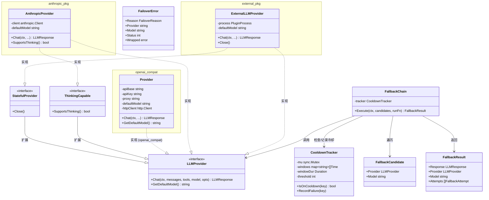
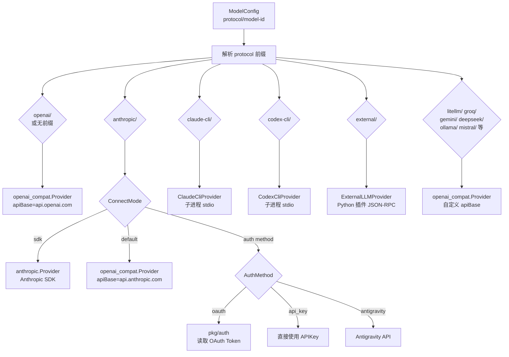

# 模块：Provider 层

## 模块概述

| 项目 | 内容 |
|------|------|
| 目录 | `pkg/providers/` |
| 职责 | 统一抽象 LLM 调用接口、多协议适配、故障转移与冷却管理 |
| 核心类型 | `LLMProvider`（接口）、`FallbackChain`、`openai_compat.Provider`、`anthropic.Provider` |
| 依赖模块 | config, auth, providers/protocoltypes |

---

## 文件清单

| 文件 | 职责 |
|------|------|
| `provider.go` | `LLMProvider`/`StatefulProvider`/`ThinkingCapable` 接口定义 |
| `factory_provider.go` | `CreateProviderFromConfig()` — 协议分发工厂 |
| `fallback.go` | `FallbackChain` — 多候选故障转移执行器 |
| `cooldown.go` | `CooldownTracker` — 速率限制冷却追踪 |
| `error_classifier.go` | `ErrorClassifier` — HTTP/字符串错误 → `FailoverReason` |
| `claude_provider.go` | Claude CLI 子进程 Provider |
| `codex_cli_provider.go` | Codex CLI 子进程 Provider |
| `external/` | 外部插件 Provider（JSON-RPC）|
| `openai_compat/` | OpenAI 兼容 HTTP 适配器 |
| `anthropic/` | Anthropic SDK 适配器（支持扩展思考）|
| `protocoltypes/types.go` | 协议共享类型：`Message`, `LLMResponse`, `ToolCall` 等 |

---

## 类关系图



---

## Provider 协议分发



---

## 协议类型 (`protocoltypes`)

### Message 结构

```
providers.Message
├── Role          string          "system" | "user" | "assistant" | "tool"
├── Content       string          文本内容
├── ReasoningContent string       扩展思考内容（Anthropic）
├── Media         []string        媒体引用（media:// refs）
├── SystemParts   []ContentBlock  系统消息分块（KV Cache 用）
├── ToolCalls     []ToolCall      工具调用列表（assistant turn）
└── ToolCallID    string          工具调用 ID（tool turn）
```

### LLMResponse 结构

```
providers.LLMResponse
├── Content           string          最终文本回复
├── ReasoningContent  string          思考过程（原始）
├── Reasoning         string          推理摘要
├── ToolCalls         []ToolCall      工具调用请求
├── Usage             *UsageInfo      Token 用量
└── ReasoningDetails  []ReasoningDetail 扩展思考详情
```

---

## 对外接口

| 接口方法 | 参数 | 返回值 | 说明 |
|----------|------|--------|------|
| `LLMProvider.Chat` | ctx, messages, tools, model, opts | `*LLMResponse, error` | 核心 LLM 调用 |
| `FallbackChain.Execute` | ctx, candidates, runFn | `FallbackResult, error` | 带故障转移的执行 |
| `CreateProviderFromConfig` | `*config.ModelConfig` | `LLMProvider, error` | 工厂方法 |

---

## 关键实现说明

### 故障转移策略

`FallbackChain.Execute` 按顺序尝试 `[]FallbackCandidate`：
- 检查 `CooldownTracker.IsOnCooldown(key)` — 跳过冷却中的 Provider
- 调用用户提供的 `runFn(ctx, provider, model)`
- 若返回 `FailoverError`：记录冷却（速率限制/过载）并尝试下一个
- 若所有候选失败：返回 `FallbackExhaustedError`

### KV Cache 优化

`anthropic.Provider` 将 `Message.SystemParts` 中带 `CacheControl{Type:"ephemeral"}` 的 `ContentBlock` 映射为 Anthropic API 的 `cache_control` 字段，触发提示词前缀缓存，减少重复 Token 费用。

### OpenAI 兼容层

`openai_compat.Provider` 通过统一的 OpenAI Chat Completions API 支持数十种模型服务商（OpenAI、Gemini、DeepSeek、Groq、Ollama、Mistral、LiteLLM 等），只需配置不同的 `apiBase` 和 `apiKey`。

### 工具定义传递

工具列表（`[]providers.ToolDefinition`）由 `ToolRegistry.ToProviderDefs()` 生成，按名称排序以保证稳定性（有利于 KV Cache 命中）。`ToolDefinition` 格式与 OpenAI function calling 规范兼容。
