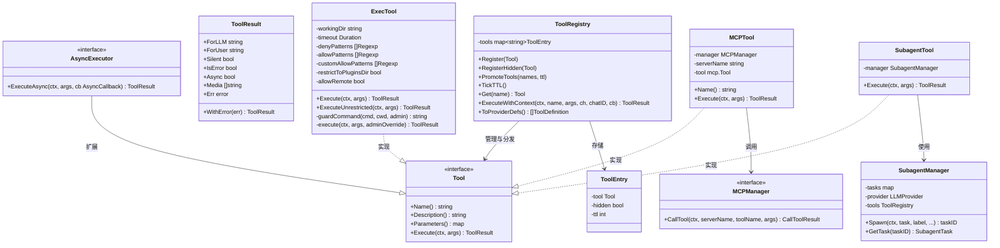
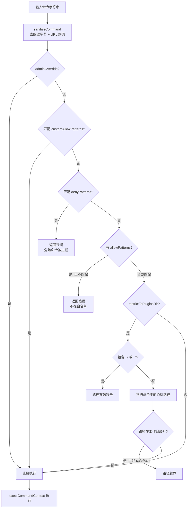

# 模块：工具系统

## 模块概述

| 项目 | 内容 |
|------|------|
| 目录 | `pkg/tools/` |
| 职责 | 定义工具接口、管理工具注册表（含 TTL）、提供内置工具实现、执行 LLM 工具循环 |
| 核心类型 | `Tool`（接口）、`ToolRegistry`、`ToolResult`、`ExecTool`、`MCPTool` |
| 依赖模块 | providers, channels, config, logger |

---

## 文件清单

| 文件 | 职责 |
|------|------|
| `base.go` | `Tool`、`AsyncExecutor`、`AsyncCallback` 接口定义 |
| `result.go` | `ToolResult` 结构体 + 所有构造函数 |
| `registry.go` | `ToolRegistry` — 注册、TTL 管理、执行分发 |
| `toolloop.go` | `RunToolLoop()` — 可复用的 LLM+工具执行循环 |
| `context.go` | `ToolContext` — 向工具注入 channel/chatID |
| `shell.go` | `ExecTool` — Shell 命令执行（含安全守卫）|
| `mcp_tool.go` | `MCPTool` — MCP 协议工具包装 |
| `web.go` | `WebSearchTool` + HTTP 客户端工具函数 |
| `web_fetch.go` | `WebFetchTool` — 网页抓取与文本提取 |
| `message.go` | `MessageTool` — 向渠道发送消息 |
| `subagent.go` | `SubagentTool`/`SubagentManager`/`SpawnTool` |
| `cron.go` | `CronTool` — 定时任务管理工具 |
| `file.go` | `ReadFileTool`、`WriteFileTool`、`ListDirTool`、`EditFileTool`、`AppendFileTool` |
| `send_file.go` | `SendFileTool` — 发送媒体文件 |
| `skills.go` | `FindSkillsTool`、`InstallSkillTool` |
| `validate.go` | `ValidatePath()` — 路径安全校验 |
| `external/` | `ExternalToolPlugin`、`ExternalSearchProvider` — 外部插件工具 |

---

## 内置工具清单

| 工具名 | 类型 | 描述 |
|--------|------|------|
| `read_file` | 同步 | 读取文件内容 |
| `write_file` | 同步 | 写入文件（覆盖）|
| `append_file` | 同步 | 追加文件内容 |
| `edit_file` | 同步 | 文件精确字符串替换 |
| `list_dir` | 同步 | 列出目录内容 |
| `exec` | 同步 | 执行 Shell 命令（含安全守卫）|
| `web_search` | 同步 | 网络搜索（需外部插件）|
| `web_fetch` | 同步 | 抓取网页内容 |
| `message` | 同步 | 向渠道发送消息 |
| `send_file` | 同步 | 向渠道发送媒体文件 |
| `find_skills` | 同步 | 搜索可用技能 |
| `install_skill` | 同步 | 安装技能 |
| `spawn` | 异步 | 异步派生子 Agent |
| `subagent` | 同步 | 同步执行子 Agent |
| `cron` | 同步 | 定时任务管理 |
| `tool_search_tool_bm25` | 同步 | BM25 工具搜索发现 |
| `tool_search_tool_regex` | 同步 | 正则工具搜索发现 |
| `mcp_*` | 同步 | MCP 服务器工具（动态注册）|

---

## 类关系图

---

## ToolResult 构造函数

| 函数 | ForLLM | ForUser | IsError | Silent | 用途 |
|------|--------|---------|---------|--------|------|
| `NewToolResult(s)` | s | "" | false | false | 仅 LLM 可见的结果 |
| `ErrorResult(s)` | s | "" | true | false | 仅 LLM 可见的错误 |
| `UserErrorResult(s)` | s | s | true | false | LLM + 用户均可见的错误（如命令失败）|
| `UserResult(s)` | s | s | false | false | LLM + 用户均可见的成功结果 |
| `SilentResult(s)` | s | "" | false | true | 静默结果（不向用户显示）|
| `AsyncResult(s)` | s | s | false | false | 异步工具立即返回的占位结果 |
| `MediaResult(s, media)` | s | s | false | false | 含媒体文件的结果 |
| `.WithError(err)` | — | — | — | — | 附加内部 error（不序列化）|

---

## 内部业务流程

### ExecTool 安全守卫

### TTL 机制（MCP 工具发现）

---

## 对外接口

| 方法 | 参数 | 返回值 | 说明 |
|------|------|--------|------|
| `ToolRegistry.Register(tool)` | `Tool` | — | 注册常驻工具 |
| `ToolRegistry.RegisterHidden(tool)` | `Tool` | — | 注册隐藏工具（需 PromoteTools 才可见）|
| `ToolRegistry.PromoteTools(names, ttl)` | `[]string, int` | — | 临时提升工具可见性 |
| `ToolRegistry.ExecuteWithContext(...)` | ctx, name, args, ch, chatID, cb | `*ToolResult` | 执行工具并注入路由上下文 |
| `ToolRegistry.ToProviderDefs()` | — | `[]ToolDefinition` | 导出当前可见工具定义 |
| `RunToolLoop(ctx, cfg, messages, ch, chatID)` | — | `ToolLoopResult, error` | 可复用的 LLM+工具循环（子 Agent 用）|

---

## 关键实现说明

### ForLLM vs ForUser 的设计意图

`ToolResult` 区分 `ForLLM` 和 `ForUser` 两个输出：
- `ForLLM`：注入 LLM 上下文作为 `role:tool` 消息，影响后续推理
- `ForUser`：实时发布给用户（可以是更简洁的摘要或与 ForLLM 相同）
- `Silent=true`：工具确实执行了但不需要用户感知（如内部状态更新）

### 路径安全（ValidatePath）

`ValidatePath(path, root, allowAbsolute)` 阻止以下攻击：
- 路径穿越：`../../etc/passwd`
- 绝对路径越界：在 restrictToPluginsDir 模式下，绝对路径须在工作目录内
- 符号链接逃逸：执行前通过 `filepath.EvalSymlinks` 再次验证

### 远程渠道 exec 防护（GHSA-pv8c-p6jf-3fpp）

`ExecTool` 在 `allowRemote=false`（默认）时，拒绝来自非内部渠道（非 cli/system）的 exec 请求，防止 Telegram 等外部渠道的攻击者通过消息触发任意命令执行。
